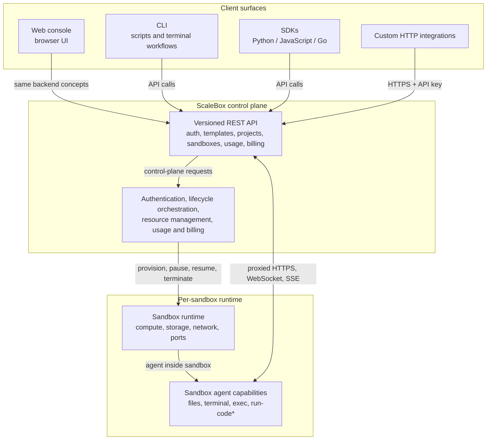

## What you are using

ScaleBox provides **isolated sandbox environments**: each sandbox has defined CPU, memory, storage, networking, and optional features such as exposed ports or WebRTC. You work with sandboxes through templates, projects, and the API—**not** underlying orchestration concepts. A **control plane** (REST API, persistence, scheduling, and billing) receives your requests, provisions sandboxes, and streams status and usage back to you.

This guide explains the **surfaces** you interact with—**web console**, **HTTP API**, **CLI**, and **SDKs**—and how they relate to the same backend and the same sandbox lifecycle.

## The control plane and your sandboxes

- **Control plane** — The ScaleBox backend exposes versioned HTTP routes (for example under `/v1/...`), authenticates requests (typically with an API key), and coordinates templates, projects, sandboxes, ports, archives, billing, and related operations. The CLI and official SDKs are thin clients over this API.
- **Data plane** — Sandboxes execute on ScaleBox-managed infrastructure. Creating or updating a sandbox applies your template and resource settings; how that is realized internally is not something you configure or see in the product surface.

All user-facing tools ultimately talk to the **same** control plane; they differ by ergonomics and where you want them in your workflow (browser, terminal, or application code).

## Web console (dashboard)

The **console** is the browser UI for your organization: sign-in, API keys, templates, sandbox list and detail, usage and billing views, and interactive flows that mirror what the API can do.

**Best for:** discovery, day-to-day operations without writing code, issuing and rotating API keys, and sharing context with teammates who prefer a GUI.

**Relationship to the API:** The console is a client of the same backend the API serves. Anything you can do in the UI has a corresponding API concept (sandboxes, templates, keys, etc.), documented under [API Reference](/en/api/).

## HTTP API

The **REST API** is the contract for automation and integrations. Use it from any language or tool that can send HTTPS requests with your API key (header such as `X-API-Key`). Beyond high-level lifecycle actions, the API now supports most end-to-end sandbox operations: resource management, file operations, terminal access, and proxied sandbox command execution and streaming.

**Best for:** CI/CD, custom internal tools, services that create and manage sandboxes on demand, and fine-grained programmatic control over sandbox resources and in-sandbox operations.

**Relationship to other tools:** The CLI and SDKs call these endpoints; they are not a separate product surface. For route-level detail, see [API Reference](/en/api/).

## CLI (`scalebox-cli`)

The **CLI** packages most public backend capabilities as commands: auth, sandboxes, templates, projects, API keys, notifications, webhooks, usage, billing, and more. For sandboxes, it now covers not only create/list/connect flows but also file-oriented and command-oriented workflows such as `sandbox exec`, plus advanced `sandbox run-code` flows on compatible templates. It stores credentials locally (for example under `~/.scalebox-cli/`) and targets your chosen API base URL.

**Best for:** terminal-first workflows, scripts, and operators who want readable commands and JSON output without maintaining SDK dependencies.

**Relationship to the API:** Each command maps to API calls, and the CLI now covers most documented backend APIs exposed to customers. See [CLI Reference](/en/cli/) for installation, authentication, and command topics.

## SDKs (Python, JavaScript, Go, …)

Official **SDKs** wrap the HTTP API with idiomatic types, helpers, and error handling for your language. They are distributed as separate repositories (for example Python, JavaScript, and Go clients linked from the docs home).

**Best for:** long-lived applications, agents, notebooks, and backends that manage sandboxes as part of product logic.

**Relationship to the API:** SDKs are generated or maintained against the same REST API; prefer them when you want maintainability over raw `curl`.

## How the pieces work together

Typical flow:

1. You **authenticate** (console session or API key for CLI/SDK/API).
2. You define **templates** and create **sandboxes** through whichever surface fits (console click-path, `scalebox-cli sandbox create`, SDK call, or `POST` to the API).
3. The control plane **provisions and runs** your sandbox; you **poll or stream** status via API/CLI/SDK or watch the console.
4. You then **work with the running sandbox** through terminal access, forwarded ports, file operations, proxied command execution, or notebook-style code execution where the template supports it.

Surfaces are **composable**: many teams use the console for keys and visibility, the CLI for local iteration, and the API or SDK in production automation.

## Getting started

1. **Account** — Sign up on your ScaleBox instance and open the [dashboard](https://www.scalebox.dev/dashboard) to create or copy an **API key**.
2. **Pick a surface** — Use the [CLI quick start](/en/cli/quick-start) for terminal setup, or choose an SDK from the links on the [Guides overview](/en/guides), or call the API directly using [API Reference](/en/api/).
3. **Create a sandbox** — Start from a public template, then explore ports, lifecycle, and advanced topics in the guides and CLI/API docs.

For a feature-focused walkthrough of WebRTC inside sandboxes, see [WebRTC in Sandboxes](/en/guides/webrtc-in-sandboxes).

<Cards>
  <Card title="CLI Reference" href="/en/cli/" />
  <Card title="API Reference" href="/en/api/" />
  <Card title="Python SDK" href="https://github.com/scalebox-dev/scalebox-sdk-python" />
  <Card title="JavaScript SDK" href="https://github.com/scalebox-dev/scalebox-sdk-js" />
  <Card title="Golang SDK" href="https://github.com/scalebox-dev/scalebox-sdk-golang" />
</Cards>
