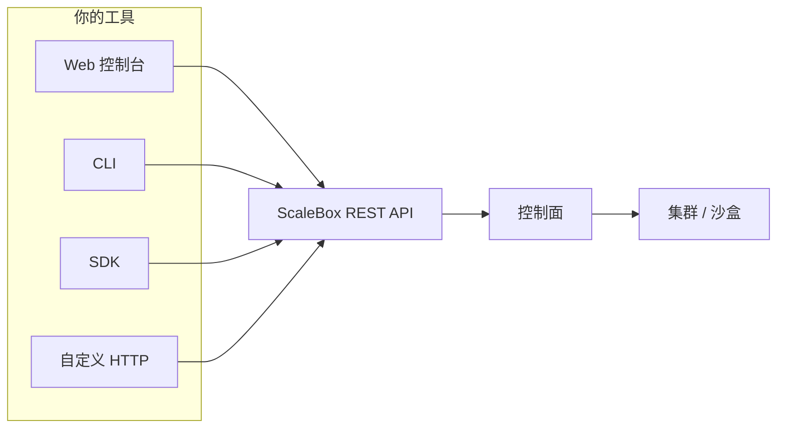

## 你在使用什么

ScaleBox 在 Kubernetes 上运行**隔离的沙盒环境**：每个沙盒是具有明确 CPU、内存、存储、网络以及可选能力（例如暴露端口或 WebRTC）的命名空间内工作负载。**控制面**（REST API、持久化、调度、计费等）接收你的请求，在集群上编排沙盒，并将状态与用量反馈给你。

本文说明你会接触到的几类**入口**——**Web 控制台**、**HTTP API**、**CLI** 与 **SDK**——以及它们如何对应同一套后端与同一套沙盒生命周期。

## 控制面与你的沙盒

- **控制面** — ScaleBox 后端提供版本化的 HTTP 路由（例如 `/v1/...`），对请求做认证（通常使用 API Key），并协调模板、项目、沙盒、端口、归档、计费等相关能力。CLI 与官方 SDK 本质上都是该 API 的客户端。
- **数据面** — 沙盒运行在集群工作节点上。创建或更新沙盒最终会落地为与你的模板和资源设定相匹配的 Kubernetes 资源（Pod、Service、网关等）。

所有面向用户的工具最终都访问**同一套**控制面；差异在于使用场景与习惯（浏览器、终端或应用代码）。

## Web 控制台（仪表板）

**控制台**是面向组织的浏览器界面：登录、API 密钥、模板、沙盒列表与详情、用量与账单视图，以及各类与 API 能力对应的可视化操作。

**适合：** 探索产品、不写代码的日常运维、签发与轮换 API 密钥、以及更习惯图形界面的协作伙伴。

**与 API 的关系：** 控制台与 API 共用同一后端。你在界面上操作的概念（沙盒、模板、密钥等）在 [API 参考](/zh-cn/api/) 中都有对应说明。

## HTTP API

**REST API** 是自动化与集成的契约。任何能发 HTTPS 请求并携带 API Key（例如 `X-API-Key` 头）的语言或工具都可以直接使用。

**适合：** CI/CD、内部工具、按需在服务中创建/销毁沙盒，以及需要精细程序化控制的场景。

**与其他工具的关系：** CLI 与 SDK 都调用这些接口，并非另一套独立产品。路径与语义详见 [API 参考](/zh-cn/api/)。

## CLI（`scalebox-cli`）

**CLI** 将常用流程封装为命令（认证、沙盒创建/列表/连接、模板、端口等）。凭据保存在本机（例如 `~/.scalebox-cli/`），并指向你配置的 API 基地址。

**适合：** 终端优先的工作流、脚本，以及希望用可读命令和 JSON 输出、又不想维护 SDK 依赖的场景。

**与 API 的关系：** 每条命令对应具体的 API 调用。安装、认证与命令说明见 [CLI 参考](/zh-cn/cli/)。

## SDK（Python、JavaScript、Go 等）

官方 **SDK** 用符合语言习惯的类型、辅助函数与错误处理封装 HTTP API，通常以独立仓库发布（文档首页可链接到 Python、JavaScript、Go 等客户端）。

**适合：** 长期运行的应用、Agent、Notebook，以及把沙盒管理纳入产品逻辑的后端服务。

**与 API 的关系：** SDK 面向同一套 REST API 维护；若更看重可维护性，可优先使用 SDK，而不是手写 `curl`。

## 各部分如何协同

典型流程：

1. **认证**——浏览器会话或供 CLI/SDK/API 使用的 API Key。
2. **定义模板并创建沙盒**——任选控制台、 `scalebox-cli sandbox create`、SDK 调用或对 API 的 `POST`。
3. 控制面在集群上**调度**；你通过 API/CLI/SDK **轮询或订阅**状态，或在控制台查看。
4. 按模板与相关指南进行**连接**（终端、端口转发、WebRTC 等）。

多种入口可以**组合使用**：常见做法是控制台管密钥与总览，CLI 做本地迭代，生产环境用 API 或 SDK 做自动化。

## 快速开始

1. **账户** — 在你的 ScaleBox 实例注册，打开 [仪表板](https://www.scalebox.dev/dashboard) **创建或复制 API Key**。
2. **选择入口** — 终端用户可看 [CLI 快速开始](/zh-cn/cli/quick-start)；也可从 [指南首页](/zh-cn/guides) 选择 SDK，或直接查阅 [API 参考](/zh-cn/api/) 自行调用 HTTP。
3. **创建沙盒** — 从公共模板起步，再在指南与 CLI/API 文档中深入端口、生命周期与高级主题。

若关注沙盒内的 WebRTC 能力，见 [沙盒中的 WebRTC](/zh-cn/guides/webrtc-in-sandboxes)。

<Cards>
  <Card title="CLI 参考" href="/zh-cn/cli/" />
  <Card title="API 参考" href="/zh-cn/api/" />
  <Card title="Python SDK" href="https://github.com/scalebox-dev/scalebox-sdk-python" />
  <Card title="JavaScript SDK" href="https://github.com/scalebox-dev/scalebox-sdk-js" />
  <Card title="Golang SDK" href="https://github.com/scalebox-dev/scalebox-sdk-golang" />
</Cards>
