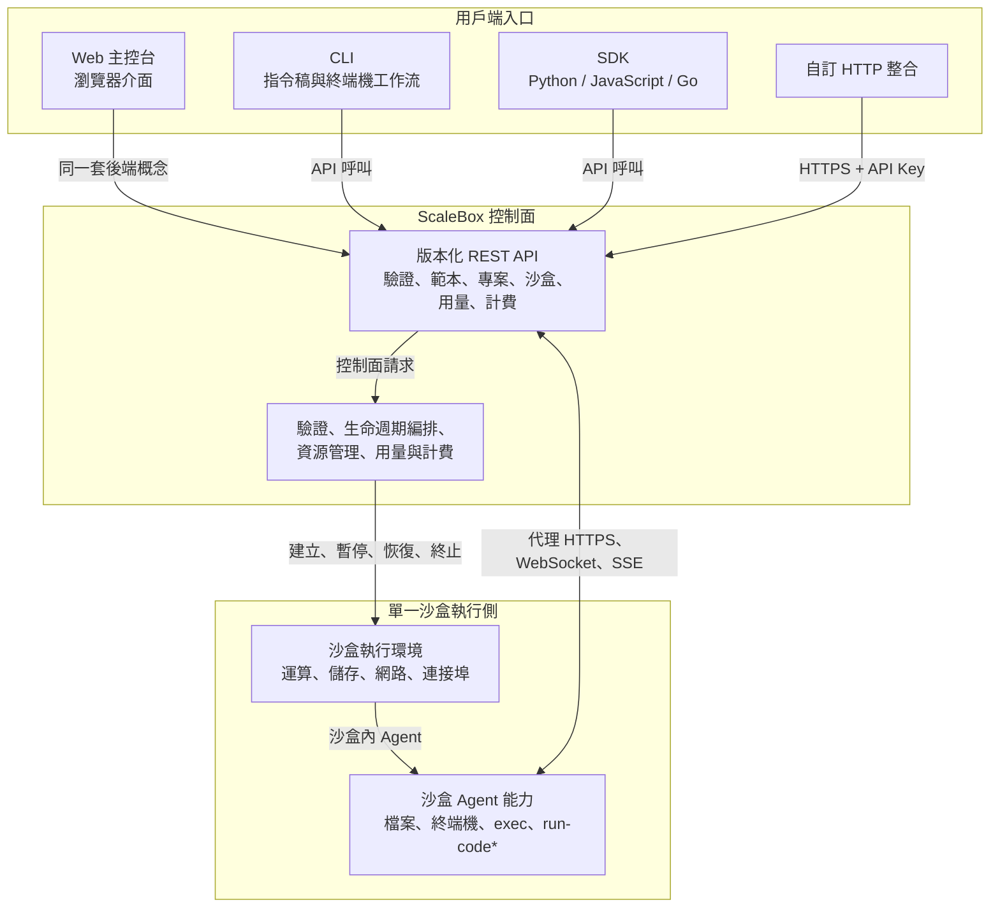

## 你在使用什麼

ScaleBox 提供**隔離的沙盒環境**：每個沙盒具有明確的 CPU、記憶體、儲存、網路以及選用能力（例如暴露連接埠或 WebRTC）。你透過範本、專案與 API 使用沙盒——**無須**接觸底層編排概念。**控制面**（REST API、持久化、排程、計費等）接收你的請求，為你建立與管理沙盒，並將狀態與用量回饋給你。

本文說明你會接觸到的幾類**入口**——**Web 主控台**、**HTTP API**、**CLI** 與 **SDK**——以及它們如何對應同一套後端與同一套沙盒生命週期。

## 控制面與你的沙盒

- **控制面** — ScaleBox 後端提供版本化的 HTTP 路由（例如 `/v1/...`），對請求做驗證（通常使用 API Key），並協調範本、專案、沙盒、連接埠、歸檔、計費等相關能力。CLI 與官方 SDK 本質上都是該 API 的用戶端。
- **資料面** — 沙盒在 ScaleBox 託管的運算基礎設施上執行。建立或更新沙盒會依你的範本與資源設定生效；底層實作不在產品介面中揭露，也無須你設定。

所有面向使用者的工具最終都存取**同一套**控制面；差異在使用情境與習慣（瀏覽器、終端機或應用程式碼）。

## Web 主控台（儀表板）

**主控台**是面向組織的瀏覽器介面：登入、API 金鑰、範本、沙盒清單與詳情、用量與帳單檢視，以及各類與 API 能力對應的可視化操作。

**適合：** 探索產品、不寫程式碼的日常維運、簽發與輪換 API 金鑰，以及偏好圖形介面的協作夥伴。

**與 API 的關係：** 主控台與 API 共用同一後端。你在介面上操作的概念（沙盒、範本、金鑰等）在 [API 參考](/zh-tw/api/) 中都有對應說明。

## HTTP API

**REST API** 是自動化與整合的契約。任何能發 HTTPS 請求並帶上 API Key（例如 `X-API-Key` 標頭）的語言或工具都可以直接使用。它現在已不只侷限於高層生命週期操作，而是支援大部分端到端沙盒能力：資源管理、檔案操作、終端機存取，以及代理式的沙盒命令執行與串流輸出。

**適合：** CI/CD、內部工具、依需求在服務中建立和管理沙盒，以及需要對沙盒資源與沙盒內操作進行精細程式化控制的場景。

**與其他工具的關係：** CLI 與 SDK 都呼叫這些介面，並非另一套獨立產品。路徑與語意詳見 [API 參考](/zh-tw/api/)。

## CLI（`scalebox-cli`）

**CLI** 已將大部分面向客戶開放的後端能力封裝為命令：驗證、沙盒、範本、專案、API 金鑰、通知、Webhook、用量、帳單等。對於沙盒，它現在不只覆蓋建立／清單／連線流程，也涵蓋檔案與命令導向的工作流，例如 `sandbox exec`，以及在相容範本上的進階 `sandbox run-code` 流程。憑證儲存在本機（例如 `~/.scalebox-cli/`），並指向你設定的 API 基底位址。

**適合：** 終端機優先的工作流、指令稿，以及希望用可讀命令與 JSON 輸出、又不想維護 SDK 依賴的場景。

**與 API 的關係：** 每條命令對應具體的 API 呼叫，而 CLI 現在已覆蓋大部分已文件化、面向客戶開放的後端 API。安裝、驗證與命令說明見 [CLI 參考](/zh-tw/cli/)。

## SDK（Python、JavaScript、Go 等）

官方 **SDK** 用符合語言慣例的型別、輔助函式與錯誤處理封裝 HTTP API，通常以獨立儲存庫發布（文件首頁可連結到 Python、JavaScript、Go 等用戶端）。

**適合：** 長期執行的應用、Agent、Notebook，以及把沙盒管理納入產品邏輯的後端服務。

**與 API 的關係：** SDK 面向同一套 REST API 維護；若更看重可維護性，可優先使用 SDK，而不是手寫 `curl`。

## 各部分如何協同

典型流程：

1. **驗證**——瀏覽器工作階段或供 CLI／SDK／API 使用的 API Key。
2. **定義範本並建立沙盒**——任選主控台、`scalebox-cli sandbox create`、SDK 呼叫或對 API 的 `POST`。
3. 控制面**建立並執行**沙盒；你透過 API／CLI／SDK **輪詢或訂閱**狀態，或在主控台檢視。
4. 沙盒執行後，你可以繼續透過終端機存取、連接埠轉送、檔案操作、代理命令執行，或在範本支援時進行 notebook 風格的程式碼執行來使用它。

多種入口可以**組合使用**：常見做法是主控台管金鑰與總覽，CLI 做本機迭代，生產環境用 API 或 SDK 做自動化。

## 快速開始

1. **帳戶** — 在你的 ScaleBox 實例註冊，開啟 [儀表板](https://www.scalebox.dev/dashboard) **建立或複製 API Key**。
2. **選擇入口** — 終端機使用者可看 [CLI 快速開始](/zh-tw/cli/quick-start)；也可從 [指南首頁](/zh-tw/guides) 選擇 SDK，或直接查閱 [API 參考](/zh-tw/api/) 自行呼叫 HTTP。
3. **建立沙盒** — 從公開範本起步，再在指南與 CLI／API 文件中深入連接埠、生命週期與進階主題。

若關注沙盒內的 WebRTC 能力，見 [沙盒中的 WebRTC](/zh-tw/guides/webrtc-in-sandboxes)。

<Cards>
  <Card title="CLI 參考" href="/zh-tw/cli/" />
  <Card title="API 參考" href="/zh-tw/api/" />
  <Card title="Python SDK" href="https://github.com/scalebox-dev/scalebox-sdk-python" />
  <Card title="JavaScript SDK" href="https://github.com/scalebox-dev/scalebox-sdk-js" />
  <Card title="Golang SDK" href="https://github.com/scalebox-dev/scalebox-sdk-golang" />
</Cards>
