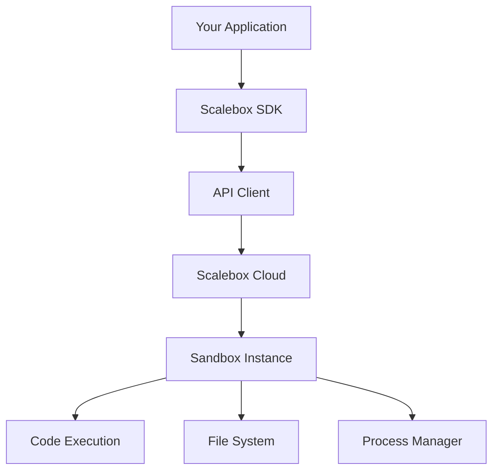

# Scalebox Python SDK

Welcome to Scalebox Python SDK! A powerful multi-language code execution sandbox tool that supports executing various programming languages in a secure, isolated environment.

## What is Scalebox?

Scalebox is a cloud-based code execution sandbox service that provides secure, isolated code execution environments. With the Python SDK, you can easily integrate code execution capabilities into your applications.

## Core Features

- **Multi-Language Support**: Supports Python, R, Node.js, TypeScript, Java, Bash and more
- **Sync/Async Execution**: Provides both synchronous `Sandbox` and asynchronous `AsyncSandbox` execution modes
- **Persistent Context**: Maintains variables and state across multiple code executions
- **Real-time Callbacks**: Supports real-time callback monitoring for stdout, stderr, results and errors
- **Rich Result Formats**: Supports various output formats: text, HTML, Markdown, SVG, images, LaTeX, JSON and more
- **File System Operations**: Complete file system operations: create, read, modify, and delete files and directories
- **Process Management**: Execute shell commands, manage processes, get process information
- **Security Isolation**: Execute code in completely isolated sandbox environments, ensuring host security

## Supported Languages

| Language | Identifier | Description |
|----------|------------|-------------|
| Python | `python` | Python 3.x interpreter |
| R | `r` | R statistical computing language |
| Node.js | `nodejs` | JavaScript runtime |
| TypeScript | `typescript` | Deno TypeScript runtime |
| Java | `java` / `ijava` | Java execution environment |
| Bash | `bash` | Shell script execution |

## Use Cases

- **Online Code Editors**: Build online IDEs or code execution platforms
- **Data Analysis Platforms**: Execute user-provided data analysis scripts
- **Automated Testing**: Run test code in isolated environments
- **Educational Platforms**: Provide safe code learning and practice environments for students
- **AI Agents**: Provide code execution capabilities for AI assistants
- **Jupyter Alternative**: Lightweight alternative to Jupyter Notebook

## Architecture Overview



## Quick Example

```python
from scalebox.code_interpreter import Sandbox

# Create sandbox

sandbox = Sandbox.create()

# Execute Python code

execution = sandbox.run_code("print('Hello, Scalebox!')", language="python")

# Get output

print(execution.logs.stdout)  # ['Hello, Scalebox!']

# Close sandbox

sandbox.kill()

```

## Next Steps

- [Installation](/sdk/installation) - Learn how to install and configure the SDK
- [Quick Start](/sdk/quickstart) - Get started with a quick tutorial
- [API Reference](/sdk/api-reference/models) - View complete API documentation
- [Examples](/sdk/examples/basic-usage) - Browse more code examples
